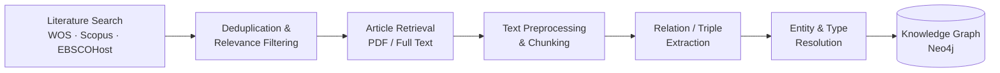

# 🌱 Plant Protein Literature Data Mining

**Turning a fragmented body of plant-protein research into a structured, queryable knowledge graph.**

---

## Overview

This project applies data mining and NLP techniques to the published literature on plant protein functional properties, with two connected goals:

1. **Systematic literature review** — searching, aggregating, and deduplicating records across major bibliographic databases to build a reliable corpus of relevant publications.
2. **Knowledge extraction** — mining the full text of that corpus to identify entities and relationships (materials, methods, treatments, and their effects on protein functionality), and organizing the extracted knowledge into a structured knowledge graph.

The broader aim is to make it easier to see patterns and connections across a large, fragmented body of plant protein research that would be difficult to review manually at scale.

> *Search strategies, prompts, and some intermediate methodology details are intentionally kept out of this public repository while the work is ongoing.*

## Pipeline

## The knowledge graph: In progress..... 