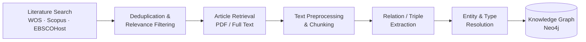
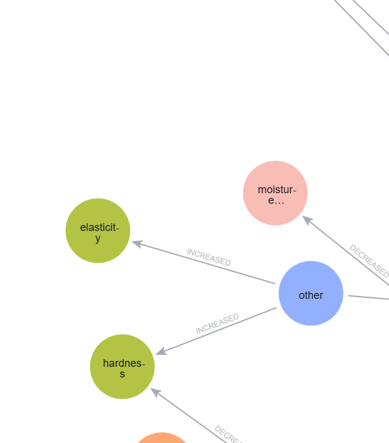

<div align="center">

# 🌱 Plant Protein Literature Data Mining

**Turning a fragmented body of plant-protein research into a structured, queryable knowledge graph.**


</div>

---

## Overview

This project applies data mining and NLP techniques to the published literature on plant protein functional properties, with two connected goals:

1. **Systematic literature review** — searching, aggregating, and deduplicating records across major bibliographic databases to build a reliable corpus of relevant publications.
2. **Knowledge extraction** — mining the full text of that corpus to identify entities and relationships (materials, methods, treatments, and their effects on protein functionality), and organizing the extracted knowledge into a structured knowledge graph.

The broader aim is to make it easier to see patterns and connections across a large, fragmented body of plant protein research that would be difficult to review manually at scale.

> *Search strategies, prompts, and some intermediate methodology details are intentionally kept out of this public repository while the work is ongoing.*

## Pipeline



## The knowledge graph, at a glance

The current graph organizes extracted findings into 8 entity types connected by directional relationships (e.g. *material X increased/decreased property Y*):

| Entity type | Count |
|---|---:|
| Material (used directly) | 709 |
| Structural property | 595 |
| Physicochemical property | 359 |
| Modification method | 347 |
| Functional property | 318 |
| Rheological property | 134 |
| Extraction method | 128 |
| Sensory property | 123 |
| **Relationships** | **10,224** |

A snapshot of the graph in Neo4j Browser:



Import scripts and node/relationship CSVs used to build this graph are in [`NER-PROJECT/PART-7-NEO4J-KG/neo4j_import/`](NER-PROJECT/PART-7-NEO4J-KG/neo4j_import/).

## Repository structure

```
Web-of-science-abstracts/    Literature search & deduplication across bibliographic databases
NER-PROJECT/                 Full pipeline from article retrieval through knowledge graph construction
├── PART-0   Article retrieval (PDF / full-text acquisition)
├── PART-1   Text preprocessing and chunking
├── PART-2   Relation/triple extraction
├── PART-3   Triple preprocessing and analysis
├── PART-4   Entity resolution
├── PART-5   Entity type resolution
├── STEP-6   Optional clean-up steps
└── PART-7   Knowledge graph construction (Neo4j)
```

## Running this locally

You'll need your own API credentials (literature databases, LLM providers, and Elsevier's TDM API where applicable) configured via a local `.env` file — see the `os.getenv(...)` calls in each script for the expected variable names.

Raw downloaded article text/figures, large database export dumps, and any credentials are **not** included in this repository (excluded via `.gitignore`) due to size, publisher licensing terms, and confidentiality.

---

<div align="center">
<sub>Work in progress — structure, scripts, and outputs will continue to evolve.</sub>
</div>
